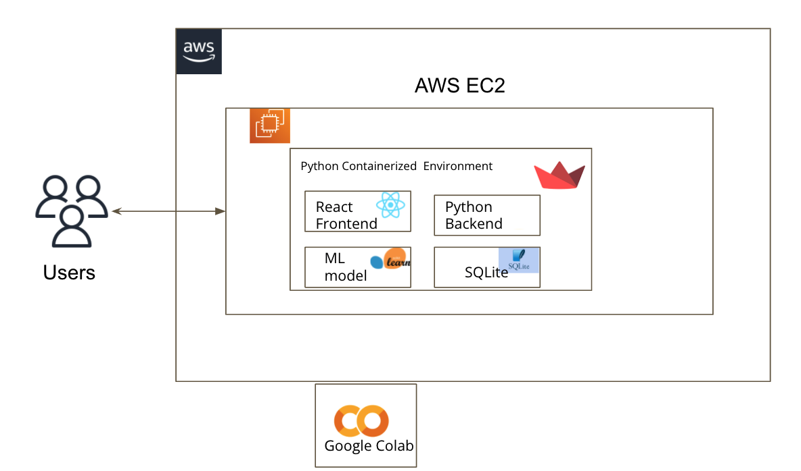
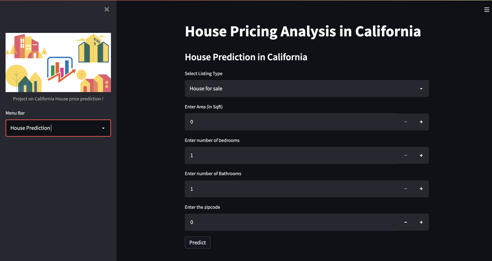
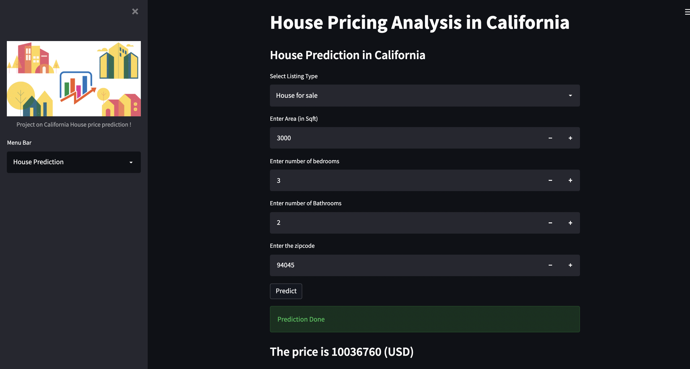

# CMPE 255 Final Project
## University : [San Jose State University](https://www.sjsu.edu/)
## Project Title: House Price Prediction in California
## Project Advisor: Prof. Vijay Eranti

Student Names:
1. Anastasia Zimina : (014543711) anastasia.zimina@sjsu.edu
2. Manjiri Kadam : (015312076) manjiri.kadam@sjsu.edu
3. Parvathi Pai : (015293460) parvathi.pai@sjsu.edu
4. Shreya Ghotankar : (015304393) shreya.ghotankar@sjsu.edu
------------------

* **Link to our application** : [Cal Mi Casa](http://3.83.55.217:8501/)
* **Presentation** : [Slides](https://docs.google.com/presentation/d/1Qcz6yF53cHo6FGkDcnNK123qhYybfSn1mx1YDzEBidM/edit#slide=id.p)
* **Demo Video** : [Video Link]()
* **Project Report** : [Report](https://docs.google.com/document/d/11UDgW_ZL0ejy9ae5obnyCqn9bwsbTP8R/edit)
* **Deployment** : [Deployment Doc](Documents/Deployment/Deployment.pdf)
-------------------

# Abstract:

A home means a future, stability. Every person's dream is to buy their dream house in a lifetime and sell it eventually with a good price and to find a better place as need changes.
Living a California dream is becoming more difficult each day. There are a lot of job opportunities out there with great weather, lifestyle and increasing demand for housing. 

House prices are always changing and it is humanly impossible to determine what the price might be tomorrow. According to the state housing department, California needs to build 180,000 new houses every year in order to keep up with demand, which is very high, there is a big valley between supply and demand. It is very important to know where you invest your money and get maximum benefit. So with help of historical data and machine learning algorithms we are trying to help people to buy affordable houses.

In our project we are trying to find the future price of  the houses by analyzing past trends in California. We have made use of Random Forest regressor to predict the house prices based on the attributes like - area, number of bedrooms, number of bathrooms, zip code and listing type. This project is developed, and built using Streamlit and hosted on  AWS cloud. 

--------------- 

# Architecture Diagram:

# UI:

# House Price Predicion 

# References 

* [Real Estate Analysis](https://towardsdatascience.com/automating-real-estate-investment-analysis-d2b07395833b)
* [streamlit app development](https://streamlit.io/)
* [Streamlit deployment](https://towardsdatascience.com/how-to-deploy-a-streamlit-app-using-an-amazon-free-ec2-instance-416a41f69dc3)

